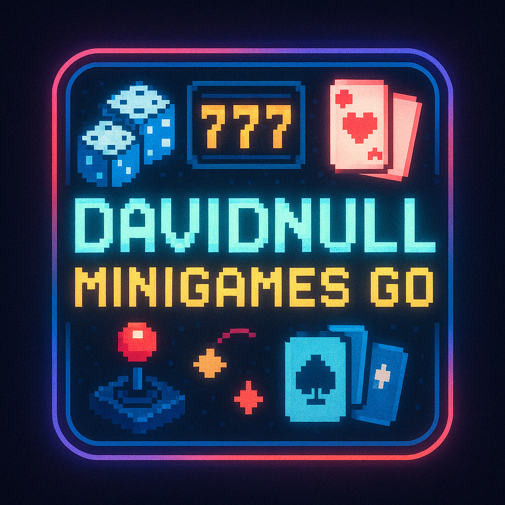

# 🎲 DavidNull-MiniGames-Go 

A collection of console-based casino games written in Go, featuring user authentication, persistent balances, and CLI interface.

## 🕹️ TO DO

- Enable play on local network with a server-client architecture
- Add user registration feature via CLI (not sure)
- Implement more games (Blackjack, Poker, Roulette...)
- Leaderboard system 
- Add achievements 
- Implement multi-player game rooms
- Develop a tournament mode 
- Add sound effects (ASCII bell or external audio)

## 🎮 Available Games

| Game | Description | Payouts |
|------|-------------|---------|
| **Dice Game** 🎲 | Bet on a number (1-6) and roll the dice | 5× your bet if you win |
| **Red or Black** 🃏 | Choose a color and test your luck | 2× your bet if you win |
| **Slot Machine** 🎰 | Spin the reels and match symbols | 3× to 25× your bet depending on symbols |
| **Fastest Typer** ⌨️ | Type 5 words as fast as you can | 2-player competition |
| **Escape the Maze** 🧭 | Navigate through a random maze to find the exit | 2-player competition |
| **Battleship** 🚢 | Classic naval combat with a 10x10 grid | 2-player competition |
| **More games coming soon!** | | |

## 💾 Installation

```bash
# Clone the repository
git clone https://github.com/yourusername/DavidNull-MiniGames-Go.git
cd DavidNull-MiniGames-Go

# Build the application
go build -o DavidNullGames ./cmd/app

# Run the application
./DavidNullGames
```

## 🎯 How to Play

1. Start the application
2. Log in with one of the predefined user accounts:
   - David (password: 123456)
   - Hector (password: 123456)
   - Jaime (password: 123456)
   - Nacho (password: 123456)
   - god (password: amen)      # 🤑 Richest player in the game 🤑
   - homeless (password: 1)     # 💔 Down on their luck... 💔
3. Choose a game from the menu
4. Follow the on-screen instructions for each game
5. Your balance is automatically saved between sessions

### 🎲 Dice Game

If the dice shows your number, you win 5× your bet!

### 🃏 Red or Black

Choose "red" or "black"
If your chosen color appears, you win 2× your bet!

### 🎰 Slot Machine

Match symbols to win:
   - Three matching symbols: Win 3× to 25× your bet
   - Two matching symbols: Get your bet back
   - Different symbols: Lose your bet

Type 'help' at the slot machine to see the paytable with symbol probabilities.

### ⌨️ Fastest Typer

A 2-player typing competition:
   - Each player gets challenged with 5 random words
   - Type the exact words (with correct spelling) as quickly as possible
   - The player who types all words correctly in the shortest time wins
   - Words are randomly selected from various categories

### 🧭 Escape the Maze

A 2-player maze navigation challenge:
   - Each player gets their own randomly generated maze
   - Use WASD keys to navigate (W=up, A=left, S=down, D=right)
   - Find the exit (E) as quickly as possible
   - The player who escapes in the shortest time wins
   - Type "quit" to give up

### 🚢 Battleship

A 2-player naval combat game:
   - Fixed 10x10 grid for balanced gameplay
   - 5 different ships of varying sizes (2-5 spaces)
   - Place ships manually or automatically
   - Take turns firing at opponent's grid
   - Sink all your opponent's ships to win
   - Classic strategic gameplay

## 🌐 Network Play (Coming Soon)

To enable networked gameplay on your local network:

1. One player will act as the host by running the server:
   ```bash
   ./DavidNullGames --server
   ```

2. Other players can connect to the host using:
   ```bash
   ./DavidNullGames --connect <host-ip-address>
   ```
3. All players will share the same YAML database of users and balances.

4. Players can join games in progress or start their own from the shared server.

## 🐰 Author

DavidNull


